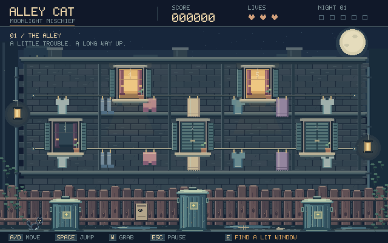
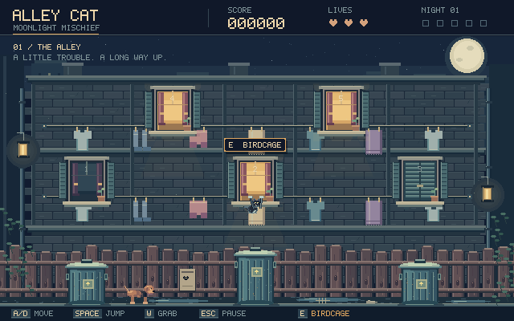

# Alley Cat - Moonlight Mischief

A self-contained Godot 4 / typed GDScript arcade platformer core. Open
`project.godot` in **Godot 4.5+** and press **F6** with `scenes/Alley.tscn` open,
or **F5** from anywhere. Validated with the portable Godot **4.5.1** Windows build.
There are no addons, C# dependencies, required texture downloads, or external
audio dependencies. The Compatibility renderer targets desktop PCs.

This is a playable core remake with compact adaptations of the classic rooms,
not a frame-accurate reproduction or a claim of finished commercial art/audio.
The alley now has an authored pixel-art backdrop, raster sprite sheets,
animated cat and dogs, subtle lighting, and a custom bitmap HUD. The five rooms
remain mechanically complete prototype environments; the new cat and HUD are
shared with them, but their scenery has not yet received this art pass.
No copyrighted original recording or MIDI is bundled.

## Project status

**As of September 6, 2026:** a playable core with a first alley visual pass, not
a finished release. All five rooms have implemented objectives; their scenery
still needs the same visual treatment as the alley. The latest recorded local
regression run passed **44 checks in Godot 4.5.1**. Desktop export testing,
human playtesting, animation refinement and final audio review remain open.

See `CHANGELOG.md` for the implementation and documentation history.

## Alley visual slice

- Textured slate-blue brickwork, a distant skyline, moonlight, warm lamps,
  shuttered windows, worn wooden fencing and reflective pavement.
- Twelve cat poses with running, blinking, climbing, jumping, falling and
  knockback animation; landing squash is visual-only.
- Detailed cans with rattling lids, six swaying garments, and a four-pose dog run.
- Warm available windows, contextual E prompts, and advance warnings for dogs
  and thrown brooms. The collision geometry and jump tuning are unchanged.
- Small dust bursts, footsteps, metal clinks, and an original eight-bar swung
  chiptune fallback instead of the previous two-second melody loop.
- A project-owned bitmap alphabet, compact score/life/progression display,
  context-sensitive control hints, and pause/game-over panels.

Actual rendered screenshots are saved at `docs/alley-preview.png` and
`docs/alley-active.png`. Asset dimensions, palette, and rebuild instructions are
in `assets/pixel/README.md`. This pass focuses on one coherent playable alley;
room scenery and further animation refinement are deliberately deferred.





## Run without installing Godot

### Play directly

If the local portable download is present, run from PowerShell. Close any
already-running copy first so the next launch loads the updated scripts/assets:

```powershell
Set-Location 'C:\Git\Alley Cat'
& '.\.tools\godot\Godot_v4.5.1-stable_win64.exe' --path .
```

### Open the editor

From the project directory:

```powershell
& '.\.tools\godot\Godot_v4.5.1-stable_win64.exe' --path . --editor
```

The `.tools` directory is local development tooling and is ignored by Git.
On another machine or a fresh checkout, obtain Godot 4.5+, import `project.godot`
in its editor and let the initial asset import finish before pressing F5.
Neither the portable engine nor the local validation harness is part of the
project source. Do not expect `.tools` commands to work on a fresh checkout
until those local tools are supplied; use your Godot executable path instead.
Desktop exporting requires the matching Godot export templates; they are not
needed to play in the editor.

## Complete source layout

```text
Alley Cat/
|-- project.godot
|-- README.md
|-- CHANGELOG.md
|-- .gitignore
|-- assets/
|   |-- audio/
|   |   `-- README.md
|   `-- pixel/
|       |-- README.md
|       |-- alley_backdrop.png
|       |-- windows.png
|       |-- trash_cans.png
|       |-- laundry.png
|       |-- cat_poses.png
|       `-- dog_run.png
|-- docs/
|   |-- .gdignore
|   |-- alley-preview.png
|   `-- alley-active.png
|-- tools/
|   `-- BuildAlleyArt.gd
|-- scenes/
|   |-- Alley.tscn
|   |-- RoomClassic.tscn
|   `-- RoomRobotVacuum.tscn
`-- scripts/
    |-- autoload/
    |   |-- EventBus.gd
    |   |-- GameManager.gd
    |   `-- AudioManager.gd
    |-- player/
    |   |-- Cat.gd
    |   `-- states/
    |       |-- CatState.gd
    |       |-- IdleState.gd
    |       |-- WalkState.gd
    |       |-- JumpState.gd
    |       |-- ClimbState.gd
    |       `-- KnockbackState.gd
    |-- alley/
    |   |-- AlleyManager.gd
    |   `-- AlleyWindow.gd
    |-- hazards/
    |   |-- StreetDog.gd
    |   |-- ThrownObject.gd
    |   `-- PatrolHazard.gd
    |-- rooms/
    |   |-- RoomBase.gd
    |   |-- RoomClassic.gd
    |   |-- Collectible.gd
    |   |-- RoomRobotVacuum.gd
    |   |-- RobotVacuum.gd
    |   `-- SleepingDog.gd
    |-- ui/
    |   `-- GameHUD.gd
    |-- presentation/
    |   |-- AlleyAtmosphere.gd
    |   |-- CatVisual.gd
    |   |-- PixelFont.gd
    |   `-- TrashCanVisual.gd
    `-- world/
        |-- WorldBuilder.gd
        `-- Clothesline.gd
```

Godot also generates an adjacent `.gd.uid` identity file for each GDScript;
keep these and the PNG `.import` configuration files with the source. The
generated `.godot/` import cache and local `.tools/` directory are ignored.
`docs/.gdignore` excludes the screenshots from Godot's resource scan, not from
version control; the screenshots remain documentation assets.
The three scene roots assemble their children at runtime, so no manual node
wiring, Inspector references, or missing assets are necessary.

## Controls

| Action | Keyboard |
| --- | --- |
| Move / travel along a grabbed line | A/D or Left/Right |
| Jump; hold for full height | Space or Z |
| Grab a nearby clothesline | Hold W or Up |
| Drop from a line | S or Down |
| Enter an overlapping lit window / open birdcage | E or Enter |
| Paddle upward underwater | Tap Space or Z |
| Pause / resume | Escape |
| Toggle both audio buses | M |
| Restart after game over | R |

Default actions are installed by `GameManager` only when absent from the
InputMap; editor-defined bindings are preserved.

## Game loop and objectives

Start with three lives. Street dogs and thrown brooms cost a life and knock the
cat away, followed by 1.5 seconds of invulnerability. Jump onto a trash can,
hold a direction for its boosted jump, then hold W near a line to hang. Travel
along the line and enter a lit window with E. Jump from the lower line to reach
the upper one. Windows rotate through shut, open, and illuminated states; every
unfinished room receives a lit turn, and completed windows display a check.

1. **Cheese & Mice:** Climb the cheese platforms and touch all five moving mice.
2. **Birdcage:** Climb the furniture, overlap the cage and press E, then catch
   the freed bird as it flies back and forth.
3. **Fishbowl:** Collect five fish while avoiding the eel. Swimming reduces
   gravity and enables repeated paddle impulses. Air lasts 12 seconds while
   submerged and refills above the water surface.
4. **Library Vases:** Land on each of four vases from above with downward
   velocity; stationary or side contacts do not count. Dodge the moving broom.
5. **Robot Vacuum:** Jump from the couch, table, or chair and land on the moving
   vacuum. The top landing must be centered within 19 pixels and have downward
   speed of at least 65 pixels/second. Jumping from the floor does not count.
   Mistimed impacts near the sleeping dog (within 135 pixels) wake it immediately;
   distant impacts add attenuated alert. Floor footsteps add quieter noise,
   alert decays over time, and approaching within 40 pixels wakes the dog.

Each classic room awards `500 + 5 * remaining_whole_seconds`; the vacuum room
awards `800 + 5 * remaining_whole_seconds`. The night multiplier applies to
the entire award. Winning all five rooms increases the multiplier and resets
their completion flags. Room failure costs exactly one life and returns to the
alley unless lives reach zero. Timeouts are failures. Difficulty ramps through
bounded hazard speed and spawn-rate increases, not unbounded physics changes.

## Architecture

**Autoload order:** `EventBus`, `AudioManager`, `GameManager`.

- `GameManager` owns lives, score, multiplier, completed room IDs, the current
  attempt token, and the `ALLEY / ROOM / TRANSITION / GAME_OVER` phase. Scene
  changes are deferred out of physics callbacks and faded with pause-safe
  tweens. Each room result carries an attempt token; stale or duplicate results
  cannot spend lives or award points twice. Restart clears the entire run.
- `EventBus` carries typed value-only notifications: score/lives changes,
  room entry/result, run start/end, cat damage/landing, and HUD messages.
  Scene-owned object references remain on local signals.
- `Cat` owns five explicit `CatState` instances. States choose motion; only
  `Cat._physics_process()` calls `move_and_slide()`. Shared steering, jump
  buffering, coyote time, water behavior and invulnerability live on the cat.
- `AlleyManager` owns local spawn timers, rotating windows and bounded hazard
  counts. Windows detect the cat through `Area2D` and emit an entry request;
  `GameManager` is the final authority on whether entry is legal.
- `RoomBase` owns the timer, HUD, cat, furniture factory and single-result
  guard. `RoomClassic` supplies four objective configurations. The vacuum room
  separates navigation (`RobotVacuum`), hearing (`SleepingDog`), and rules
  (`RoomRobotVacuum`) into independent components.
- `AudioManager` pools ten SFX voices and crossfades two music players. Pitch
  changes apply to individual SFX voices, never to the Music bus. It generates
  original fallback PCM chiptunes and sound effects once at startup. Closing
  the game window drains active audio before shutdown.
- `CatVisual`, `TrashCanVisual` and `AlleyAtmosphere` own pose selection,
  lid animation, lighting accents and capped particle effects. Their visual
  transforms do not modify collision bodies or jump formulas. `GameHUD` uses
  `PixelFont` for the bitmap display and preserves room-specific instructions.

### Physics and pixel presentation

- Native viewport: **640 x 400**, integer viewport stretching, nearest texture
  sampling and pixel-snapped rendering. Initial desktop window: **1280 x 800**.
- Physics retains floating-point positions. Do not round `Cat.position` every
  frame: doing so loses subpixel motion and destabilizes low-speed movement.
- Normal jump: `gravity = 2 * height / apex_time^2` and
  `jump_velocity = -2 * height / apex_time`, using 84 pixels and 0.38 seconds.
- Trash-can launch: `vertical_velocity = -sqrt(2 * gravity * launch_height)`,
  with a 155-pixel height and a directional horizontal impulse.
- Coyote time is 0.10 seconds; input buffer is 0.12 seconds. Releasing jump
  early multiplies upward velocity by 0.52. Air steering uses 55% acceleration.
- Clotheslines are non-solid sensor areas. Climb state removes gravity,
  constrains movement to line endpoints, and supports jump/drop disengagement.
- Furniture platforms are one-way; floors and alley trash cans are solid.
  The vacuum runs before the cat in physics order and uses an actual collision
  body, so top contact and lateral contact have distinct collision normals.

### Collision layers

| Inspector layer | Bitmask | Purpose |
| --- | --- | --- |
| 1 | 1 | World solids and one-way furniture |
| 2 | 2 | Cat |
| 3 | 4 | Hazard sensors |
| 4 | 8 | Window / collectible sensors |
| 5 | 16 | Clothesline sensors |
| 6 | 32 | Moving platforms / robot vacuum |

The cat's physical mask is `1 | 32`, and its `platform_floor_layers` is `32`.
Sensors use mask `2`; they detect the cat even though the cat does not physically
collide with the sensor's layer. The vacuum uses layer `32` and mask `1`.
World geometry uses layer `1` and mask `0`.

### Main public entry points

```gdscript
GameManager.enter_room(room_id: int, return_position: Vector2) -> bool
GameManager.finish_room(won: bool, base_points: int, token: int) -> void
GameManager.hurt_in_alley() -> void
GameManager.restart_run() -> void
AudioManager.register_track(track_id: StringName, stream: AudioStream) -> void
AudioManager.play_music(track_id: StringName, fade_seconds: float = 0.4) -> void
AudioManager.play_sfx(effect: StringName, pitch: float = 1.0, variation: float = 0.07) -> void
```

Room IDs are the `GameManager.RoomId` enum, in the order listed above. A room
copies `GameManager.attempt_id` when it starts and returns that token with its
result. For editor iteration, running `RoomClassic.tscn` directly selects Cheese;
running `RoomRobotVacuum.tscn` directly initializes the vacuum room.

## Original music integration

See `assets/audio/README.md`. Place authorized rendered recordings at the
documented paths, import them in Godot, and they replace the generated music.
The fallback score is newly synthesized and is **not the original soundtrack**.
No source recording or MIDI was supplied with the task, so preserving the actual
original audio requires supplying those assets. MIDI files must be rendered to
an audio format first or played through a separately integrated MIDI system.

## Validation

The 44-check result below is the last recorded gameplay validation, not a new
test run for the September 6 documentation update. There is no repository CI
pipeline or shipped test harness; validation tooling currently lives locally.

Godot 4.5.1 imports and runs the project. A local headless integration harness
in the ignored `.tools` directory exercises 44 checks covering bus setup, jump
height, launch strength, clothesline grabbing, window collision/entry, every
room's objective logic, real vacuum top collisions, wall bouncing, dog alert,
attempt-token rejection, scoring, progression, timeout, game over and restart.
These automated checks do not replace human playtesting, audio review, desktop
export checks or an art/level-balancing pass.

```powershell
& '.\.tools\godot\Godot_v4.5.1-stable_win64_console.exe' --headless --path . --editor --import --quit
& '.\.tools\godot\Godot_v4.5.1-stable_win64_console.exe' --headless --path . res://.tools/Validate.tscn --quit-after 6000
```

The second command needs the local validation harness, which is not a runtime
dependency or part of the source layout. Forced `--quit-after` shutdowns during
active audio may report a final audio-playback leak; the harness and normal
window-close path stop audio before exiting.
